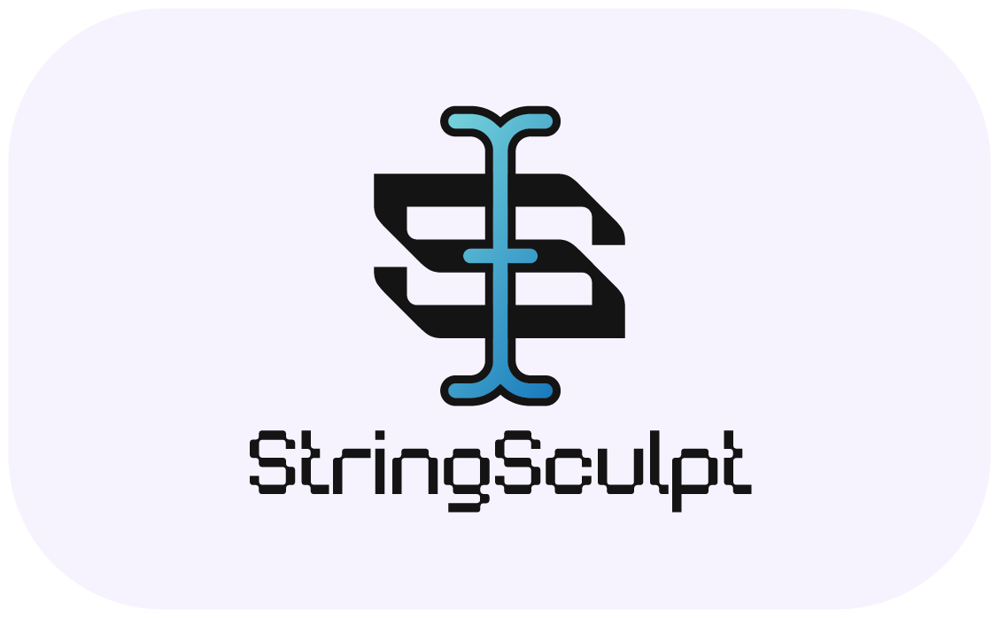

<p align="center">
  
</p>

<p align="center">
    <i>StringSculpt is a minimalistic Windows application that allows you to quickly format and replace selected text, or generate new text using a simple keyboard shortcut.</i>
</p>


</br>

## Demo:


</br>

## How it works:
1. When the keyboard shortcut `Ctrl + Shift + F` is recognized, it calls our CustomTkinter UI.
   - If there is text selected, it enters "sculpt mode", where it will edit your selected text
   - if there is *no* text selected, it enters "generative mode", where it generates any text you want based on the prompt.
2. Once the text to be edited (if any), as well as the user prompt get sent to an LLM api. I personally recommend [groq](https://console.groq.com), as it's super fast, and free.
3. Your old text is replaced by your sculpted text!

</br>

## Quick start guide:

Make sure [python](https://python.org/downloads) and [git](https://git-scm.org/downloads) are installed. 

Navigate to the directory you want to install StringScript, and run:

```
git clone https://dot-justin/stringsculpt
cd StringSculpt
pip install -r requirements.txt
```
Now, you need to add your api key in the *.env*. I have provided a `.env.example`, so you can edit it and remove the .example file extension, so you're only left with `.env`. This is where the program will pull your api key from, and you need to edit this before you can use the program.

Contents of .env:
```
API_KEY=GROQ_API_KEY_HERE
BASE_URL=https://api.groq.com/openai/v1/chat/completions
```

Once that's finished, StringSculpt is installed and ready to go! To run the application, run:

`python main.py`

You won't see anything happen, so go select some text and commit the shortcut `Ctrl + Shift + F` to memory :)

*Please note that if you keep holding down the Shift/Control keys while the program starts, it will be unable to capture your selected text. I'm working on a solution to this, but for now, just let the keys go quickly after pressing F.*

</br>

## Customization:

- Hotkey: The default hotkey is `Ctrl + Shift + F`. You can change this by modifying the `hk.register` call in the script.
- LLM Temperature: Adjust the creativity of the AI by changing the LLM_TEMPERATURE variable on line `17` of `main.py`.
